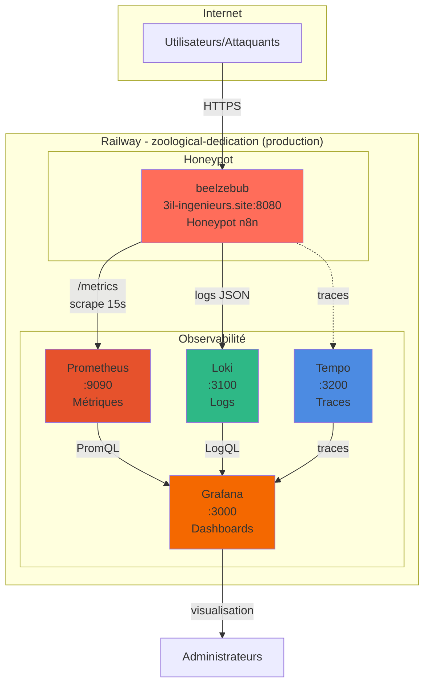

# 🏗️ Architecture Complète du Projet Railway - zoological-dedication

## 📊 Vue d'Ensemble

**Projet :** `zoological-dedication`  
**Environnement :** `production`  
**Région :** `europe-west4-drams3a`

## 🔗 Services Déployés (5 services)

### 1. beelzebub - Honeypot n8n

**Rôle :** Honeypot simulant n8n 1.120.0 pour capturer les tentatives d'exploitation CVE-2026-21858

**Configuration :**
- **Port :** `8080`
- **Domaine public :** `3il-ingenieurs.site`
- **Domaine privé :** `beelzebub.railway.internal`
- **Service ID :** `bef47d0b-e2af-471d-8ded-329c46066de1`

**Variables importantes :**
- `PORT=8080`
- `OPEN_AI_SECRET_KEY` (configuré pour LLM)
- `RAILWAY_PUBLIC_DOMAIN=3il-ingenieurs.site`

**Endpoints exposés :**
- `/metrics` - Métriques Prometheus
- `/` - Page d'accueil n8n
- `/signin` - Page de connexion
- `/rest/*` - API REST n8n
- `/form/*` - Form webhooks (cible CVE-2026-21858)
- `/webhook/*` - Webhooks

**Relations :**
- → **Prometheus** : Expose les métriques via `/metrics`
- → **Loki** : Génère des logs structurés JSON

---

### 2. Prometheus - Collecte de Métriques

**Rôle :** Collecte et stocke les métriques de beelzebub

**Configuration :**
- **Port :** `9090`
- **Domaine public :** `prometheus-production-5ee3.up.railway.app`
- **Domaine privé :** `prometheus-27700a81.railway.internal`
- **Service ID :** `0c9a1d78-2565-4302-ad94-fb7dd82756fb`

**Variables importantes :**
- `PORT=9090`
- `PROMETHEUS_CONFIG_PATH=/prometheus/prometheus.yml`
- `PROMETHEUS_TARGETS=https://3il-ingenieurs.site/metrics`
- `SCRAPE_INTERVAL=15s`

**Volume :**
- **Nom :** `prometheus-volume-Yzvy`
- **Mount path :** `/prometheus`
- **Volume ID :** `7c1051fc-5976-438b-a0e6-709206e36fa7`

**Relations :**
- ← **beelzebub** : Scrape les métriques depuis `https://3il-ingenieurs.site/metrics`
- → **Grafana** : Fournit les métriques via `PROMETHEUS_INTERNAL_URL`

**État actuel :**
- ⚠️ Target `beelzebub` manquant dans la configuration (à corriger)

---

### 3. Loki - Agrégation de Logs

**Rôle :** Collecte, indexe et stocke les logs structurés

**Configuration :**
- **Port :** `3100`
- **Domaine privé :** `loki.railway.internal`
- **Service ID :** `8591834d-6be5-46b4-a800-35019ba0ef9f`

**Variables importantes :**
- `PORT=3100`

**Volume :**
- **Nom :** `loki-volume-SZ9v`
- **Mount path :** `/loki`
- **Volume ID :** `464620f2-71c0-4d73-b48a-d7bb89566e45`

**Relations :**
- ← **beelzebub** : Reçoit les logs structurés JSON
- → **Grafana** : Fournit les logs via `LOKI_INTERNAL_URL`

**État actuel :**
- ⚠️ Configuration de collecte à vérifier (Promtail nécessaire ?)

---

### 4. Tempo - Traces Distribuées

**Rôle :** Collecte et stocke les traces de performance

**Configuration :**
- **Port :** `3200` (supposé)
- **Domaine privé :** `tempo.railway.internal`

**Relations :**
- ← **beelzebub** : Reçoit les traces (si configuré)
- → **Grafana** : Fournit les traces via `TEMPO_INTERNAL_URL`

**État actuel :**
- ⚠️ Configuration à vérifier

---

### 5. Grafana - Dashboard et Visualisation

**Rôle :** Visualisation des métriques, logs et traces

**Configuration :**
- **Port :** `3000`
- **Domaine public :** `grafana-production-8143.up.railway.app`
- **Domaine privé :** `grafana.railway.internal`
- **Service ID :** `43567c85-718f-4b07-9b3b-194dd28d1a9d`

**Variables importantes :**
- `PORT=3000`
- `GF_SECURITY_ADMIN_USER=koff75`
- `GF_SECURITY_ADMIN_PASSWORD=7jknxzf69en8y7iktgfrx5fw`
- `PROMETHEUS_INTERNAL_URL=http://prometheus-27700a81.railway.internal:9090`
- `LOKI_INTERNAL_URL=http://loki.railway.internal:3100`
- `TEMPO_INTERNAL_URL=http://tempo.railway.internal:3200`

**Plugins installés :**
- `grafana-simple-json-datasource`
- `grafana-piechart-panel`
- `grafana-worldmap-panel`
- `grafana-clock-panel`

**Volume :**
- **Nom :** `grafana-volume-Rdld`
- **Mount path :** `/var/lib/grafana/`
- **Volume ID :** `052d3b65-93ee-4491-bf51-a06725153344`

**Relations :**
- ← **Prometheus** : Lit les métriques
- ← **Loki** : Lit les logs
- ← **Tempo** : Lit les traces

**État actuel :**
- ⚠️ Datasources à configurer dans l'UI Grafana
- ⚠️ Dashboards à importer

---

## 🔄 Flux de Données

### Flux Métriques

```
beelzebub (3il-ingenieurs.site:8080)
    │
    │ /metrics (expose)
    │
    ▼
Prometheus (prometheus-production-5ee3.up.railway.app:9090)
    │
    │ scrape toutes les 15s
    │
    │ (via PROMETHEUS_INTERNAL_URL)
    │
    ▼
Grafana (grafana-production-8143.up.railway.app:3000)
    │
    │ Query PromQL
    │
    └─► Dashboards (beelzebub-overview, exploit-detection, ip-analysis)
```

### Flux Logs

```
beelzebub (génère logs JSON structurés)
    │
    │ logs Railway
    │
    ▼
Loki (loki.railway.internal:3100)
    │
    │ (via LOKI_INTERNAL_URL)
    │
    ▼
Grafana (grafana-production-8143.up.railway.app:3000)
    │
    │ Query LogQL
    │
    └─► Dashboards (logs corrélés avec métriques)
```

### Flux Traces

```
beelzebub (génère traces)
    │
    │ (si configuré)
    │
    ▼
Tempo (tempo.railway.internal:3200)
    │
    │ (via TEMPO_INTERNAL_URL)
    │
    ▼
Grafana (grafana-production-8143.up.railway.app:3000)
    │
    │ Query traces
    │
    └─► Dashboards (corrélation traces/logs/métriques)
```

---

## 🌐 URLs et Domaines

### URLs Publiques

| Service | URL Publique | Port |
|---------|--------------|------|
| **beelzebub** | `3il-ingenieurs.site` | 443 (HTTPS) |
| **Prometheus** | `prometheus-production-5ee3.up.railway.app` | 443 (HTTPS) |
| **Grafana** | `grafana-production-8143.up.railway.app` | 443 (HTTPS) |
| **Loki** | N/A (interne uniquement) | - |
| **Tempo** | N/A (interne uniquement) | - |

### URLs Internes (Railway)

| Service | URL Interne | Port |
|---------|-------------|------|
| **beelzebub** | `beelzebub.railway.internal` | 8080 |
| **Prometheus** | `prometheus-27700a81.railway.internal` | 9090 |
| **Grafana** | `grafana.railway.internal` | 3000 |
| **Loki** | `loki.railway.internal` | 3100 |
| **Tempo** | `tempo.railway.internal` | 3200 |

---

## 📦 Volumes et Stockage

| Service | Volume | Mount Path | Usage |
|---------|--------|------------|-------|
| **Prometheus** | `prometheus-volume-Yzvy` | `/prometheus` | Configuration et données TSDB |
| **Loki** | `loki-volume-SZ9v` | `/loki` | Logs indexés |
| **Grafana** | `grafana-volume-Rdld` | `/var/lib/grafana/` | Dashboards, datasources, config |

---

## 🔐 Variables Partagées (Railway)

Railway expose automatiquement des variables partagées entre services :

- `RAILWAY_SERVICE_BEELZEBUB_URL=3il-ingenieurs.site`
- `RAILWAY_SERVICE_GRAFANA_URL=grafana-production-8143.up.railway.app`
- `RAILWAY_SERVICE_PROMETHEUS_URL=prometheus-production-5ee3.up.railway.app`

Ces variables permettent aux services de se découvrir automatiquement.

---

## 🎯 État Actuel de la Configuration

### ✅ Configuré et Fonctionnel

1. **beelzebub**
   - ✅ Déployé et accessible
   - ✅ Expose `/metrics`
   - ✅ Génère des logs structurés
   - ✅ Domaine public configuré

2. **Prometheus**
   - ✅ Service démarré
   - ✅ Variables configurées
   - ⚠️ Target beelzebub manquant dans `/etc/prometheus/prom.yml`

3. **Grafana**
   - ✅ Service démarré
   - ✅ Variables internes configurées
   - ⚠️ Datasources à configurer dans l'UI
   - ⚠️ Dashboards à importer

4. **Loki**
   - ✅ Service démarré
   - ⚠️ Configuration de collecte à vérifier

5. **Tempo**
   - ✅ Service démarré
   - ⚠️ Configuration à vérifier

---

## 🔧 Actions Restantes

### Priorité 1 : Prometheus

1. ✅ Variables configurées
2. ⚠️ **Ajouter le target beelzebub dans `/etc/prometheus/prom.yml`**
3. ⚠️ Redémarrer Prometheus
4. ⚠️ Vérifier que le target est UP

### Priorité 2 : Grafana

1. ⚠️ **Configurer les datasources dans l'UI :**
   - Prometheus : `http://prometheus-27700a81.railway.internal:9090` (UID: `prometheus`)
   - Loki : `http://loki.railway.internal:3100` (UID: `loki`)
   - Tempo : `http://tempo.railway.internal:3200` (UID: `tempo`)

2. ⚠️ **Importer les dashboards :**
   - `beelzebub-overview.json`
   - `beelzebub-exploit-detection.json`
   - `beelzebub-ip-analysis.json`

### Priorité 3 : Loki

1. ⚠️ **Vérifier la collecte de logs :**
   - Déployer Promtail si nécessaire
   - Configurer la collecte depuis Railway logs

---

## 📊 Diagramme d'Architecture



---

## 🔍 Détails Techniques

### Communication Interne

Les services Railway communiquent via :
- **Domaines privés** : `*.railway.internal`
- **Variables d'environnement** : `*_INTERNAL_URL`
- **Découverte automatique** : Variables partagées Railway

### Sécurité

- **beelzebub** : Exposé publiquement (honeypot)
- **Prometheus** : Exposé publiquement (à sécuriser si nécessaire)
- **Grafana** : Exposé publiquement (authentification configurée)
- **Loki/Tempo** : Internes uniquement

### Performance

- **Scrape interval** : 15s (configurable)
- **Rétention Prometheus** : 15 jours (par défaut)
- **Volumes** : Persistance des données

---

## 📝 Notes Importantes

1. **Target beelzebub manquant** : Le fichier `/etc/prometheus/prom.yml` doit être modifié pour inclure le target beelzebub
2. **Datasources Grafana** : À configurer manuellement dans l'UI avec les UIDs corrects
3. **Collecte de logs** : Vérifier si Promtail est nécessaire pour collecter les logs Railway
4. **Traces** : Configuration Tempo à vérifier si beelzebub génère des traces

---

## 🎯 Prochaines Étapes

1. ✅ **Prometheus** : Ajouter target beelzebub dans la config
2. ⏭️ **Grafana** : Configurer datasources et importer dashboards
3. ⏭️ **Loki** : Vérifier/configurer la collecte de logs
4. ⏭️ **Tempo** : Vérifier la configuration des traces (optionnel)
